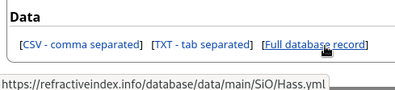

# Easy Python interface to RefractiveIndex database

The original database<br>
https://github.com/polyanskiy/refractiveindex.info-database

Database files parsing was made with a modified version of `refractiveIndex.py` from [PyTMM project](https://github.com/kitchenknif/PyTMM) by [Pavel Dmitriev](https://github.com/kitchenknif).

## Installation

```
pip install refractiveindex
```

## Usage


```python
from refractiveindex import RefractiveIndexMaterial

SiO = RefractiveIndexMaterial(shelf='main', book='SiO', page='Hass')

wavelength_nm = 600  # [nm]

SiO.get_epsilon(wavelength_nm)
# (3.8633404437869827+0.003931076923076923j)

SiO.get_refractive_index(wavelength_nm)
# (1.96553846)

SiO.get_extinction_coefficient(wavelength_nm)
# (0.001)
```

Notes: 
- here the time dependence is assumed to be $\mathrm{e}^{-\mathrm{i} \omega t}$, so $\operatorname{Im}\varepsilon > 0$ is responsible for the losses.
- if there is a space in the name, one should write underscore instead of it, i.e. not `page='Rodriguez-de Marcos'` but `page='Rodriguez-de_Marcos'`.


## How to get material page names

You can find the proper “page” name by hovering your cursor on the link in the Data section



Or you can look up folders in this repository<br>
https://github.com/polyanskiy/refractiveindex.info-database

## Simular projects for Julia

Julia interface to refractiveindex.info database<br>
https://github.com/stillyslalom/RefractiveIndex.jl
